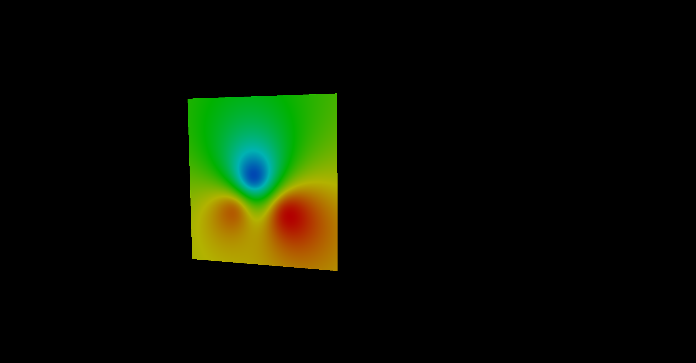

# Custom Shader Example 
This script shows and example of custom  shader. 
Shaders are part of webgl rendering pipeline that can be programmed using GLSL (OpenGL Shader Language). GLSL is C derivative. Webgl exposes two shaders in the pipe line, the vertex shader and the fragment shader. 

The script uses inverse distance weighting between several points to generate a heatmap of the terrain.

